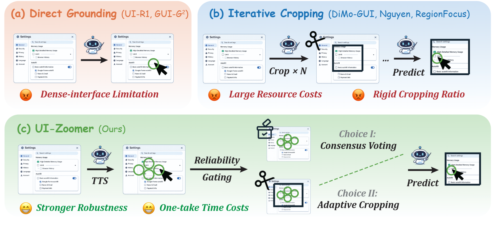
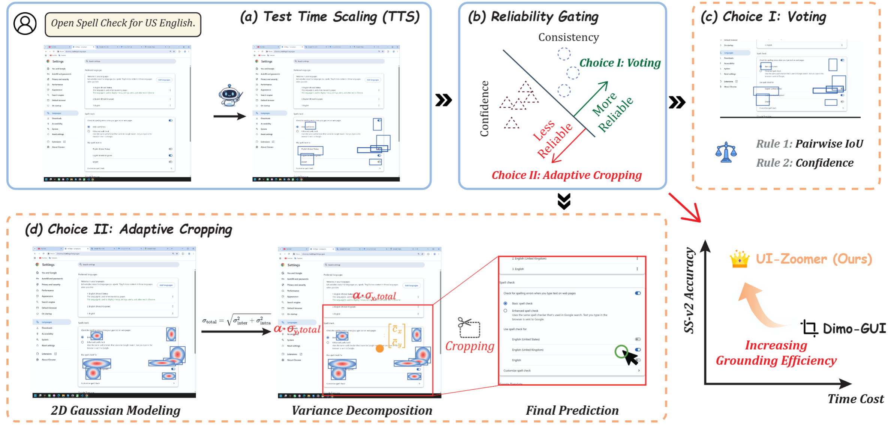

<div align="center">

<h1>UI-Zoomer: Uncertainty-Driven Adaptive Zoom-In for GUI Grounding</h1>

<p>
  Fei Tang<sup>1,*</sup>, Bofan Chen<sup>1,*</sup>, Zhengxi Lu<sup>1</sup>, Tongbo Chen<sup>1</sup><br>
  Songqin Nong<sup>2</sup>, Tao Jiang<sup>2</sup>, Wenhao Xu<sup>2</sup><br>
  Weiming Lu<sup>1</sup>, Jun Xiao<sup>1</sup>, Yueting Zhuang<sup>1</sup>, Yongliang Shen<sup>1,&dagger;</sup>
</p>

<p>
  <sup>1</sup>Zhejiang University &nbsp <sup>2</sup>Ant Group<br>
  <small><sup>*</sup>Equal contributions, <sup>&dagger;</sup>Corresponding authors</small>
</p>
</div>


<p align="center">
 <a href="">Arxiv</a> 
| 📑 <a href="https://zju-real.github.io/UI-Zoomer/">WebPage</a> 
<br>
</p>

## 🔥 News 
- **2026.03:** We release our repository.

## 📖 Overview 
GUI grounding aims to localize interface elements in screenshots given natural language instructions. Despite recent progress, modern GUI grounding models still struggle on **small icons**, **dense layouts**, and **high-resolution interfaces**, where a single forward pass often lacks sufficient spatial resolution.

A common solution is **test-time zoom-in**: crop a region and re-run inference at a higher effective resolution. However, existing zoom-in methods usually:

- apply cropping uniformly to all samples,
- use fixed crop ratios,
- ignore whether the current prediction is actually uncertain.

To address this, we propose **UI-Zoomer**, a **training-free adaptive zoom-in framework** for GUI grounding. UI-Zoomer treats both the **trigger** and the **scale** of zoom-in as an uncertainty quantification problem.

Specifically, UI-Zoomer:

- samples multiple candidate predictions from the base model,
- estimates prediction reliability using **spatial consensus** and **token-level confidence**,
- directly resolves reliable cases by **consensus voting**,
- routes only uncertain cases to an **adaptive zoom-in refinement** stage,
- determines crop size from **prediction variance decomposition**.




## 📝 Key Idea

UI-Zoomer follows a simple principle:

> **Zoom only when uncertain, and zoom by how much the predictions disagree.**

This is achieved through two core design choices:

### 1. Reliability Gating
A gating score combines:

- **spatial consensus** across stochastic predictions,
- **token-level generation confidence**.

This avoids unnecessary zoom-in for already reliable predictions.

### 2. Adaptive Crop Sizing
For uncertain cases, UI-Zoomer computes crop size from:

- **inter-sample variance**: disagreement among predictions,
- **intra-sample variance**: extent of individual predicted boxes.

This yields a per-instance crop region instead of a hand-designed fixed crop ratio.
<br>



## 🚀 QuickStart 
### Installation
```bash
conda create -n ui-zoomer python=3.10 -y
conda activate ui-zoomer
pip install -r requirements.txt
```
### Runnning
🚨 Remember to change all paths (eg. model path, image path, annotation path, log path) based on your own need before running the scripts! 
```bash
bash UI-Zoomer/scripts/UI-Zoomer_on_ScreenSpotPro/run_uizoomer_sspro.sh
bash UI-Zoomer/scripts/UI-Zoomer_on_ScreenSpot/run_uizoomer_ssv2.sh
bash UI-Zoomer/scripts/UI-Zoomer_on_UIVision/run_uizoomer_uivision.sh
```


## 📈 Main results

UI-Zoomer consistently improves strong GUI grounding backbones across three challenging benchmarks: **ScreenSpot-Pro**, **ScreenSpot-v2**, and **UI-Vision**. In the paper, the method achieves average gains of up to **+13.4%**, **+4.2%**, and **+10.3%** on these three benchmarks, respectively. These results show that uncertainty-driven zoom-in is broadly effective across both general-purpose and GUI-specialized VLMs.

### ScreenSpot-Pro

ScreenSpot-Pro is the most challenging benchmark in our evaluation suite, featuring **4K professional desktop environments**, **very small targets**, and **dense UI layouts**. UI-Zoomer improves all four evaluated backbones by a large margin, with the strongest gain reaching **+13.4** points on Qwen2.5-VL-7B.

| Model | Text | Icon | Avg | + UI-Zoomer (Text) | + UI-Zoomer (Icon) | + UI-Zoomer (Avg) | Gain |
|------|-----:|-----:|----:|-------------------:|-------------------:|------------------:|-----:|
| Qwen2.5-VL-7B | 40.6 | 6.6 | 27.6 | 54.0 | 19.9 | 41.0 | +13.4 |
| GUI-G²-7B | 64.1 | 23.3 | 48.7 | 76.7 | 36.8 | 61.4 | +12.7 |
| UI-Venus-7B | 66.7 | 22.9 | 50.0 | 78.1 | 35.4 | 61.8 | +11.8 |
| UI-Venus-72B | 74.0 | 35.3 | 59.2 | 81.3 | 46.0 | 67.8 | +8.6 |

More detailed category-wise results on ScreenSpot-Pro further show that the improvements are especially strong on **icon grounding** and difficult professional applications such as Office and OS-style environments.

### ScreenSpot-v2

ScreenSpot-v2 covers **mobile**, **desktop**, and **web** interfaces. Although the benchmark is easier than ScreenSpot-Pro overall, UI-Zoomer still brings consistent gains, with the largest average improvement of **+4.2** points on Qwen2.5-VL-7B.

| Model | Overall Text | Overall Icon | Overall Avg | + UI-Zoomer (Text) | + UI-Zoomer (Icon) | + UI-Zoomer (Avg) | Gain |
|------|-------------:|-------------:|------------:|-------------------:|-------------------:|------------------:|-----:|
| UI-Venus-7B | 97.4 | 89.7 | 94.0 | 97.8 | 91.2 | 94.9 | +0.9 |
| Qwen2.5-VL-7B | 92.3 | 80.5 | 87.2 | 95.7 | 85.9 | 91.4 | +4.2 |
| GUI-G²-7B | 97.1 | 89.2 | 93.6 | 96.5 | 90.3 | 93.8 | +0.2 |

A finer-grained breakdown shows that gains on ScreenSpot-v2 mainly come from **Desktop** and **Web**, while **Mobile** improvements are smaller, suggesting that zoom-in is most helpful when layouts are denser and targets are visually smaller.

### UI-Vision

UI-Vision focuses on **fine-grained desktop grounding** across **Basic**, **Functional**, and **Spatial** categories. UI-Zoomer consistently improves all four backbones, with the largest average gain reaching **+10.3** points on Qwen2.5-VL-7B.

| Model | Overall Text | Overall Icon | Overall Avg | + UI-Zoomer (Text) | + UI-Zoomer (Icon) | + UI-Zoomer (Avg) | Gain |
|------|-------------:|-------------:|------------:|-------------------:|-------------------:|------------------:|-----:|
| Qwen2.5-VL-7B | 38.2 | 7.9 | 13.3 | 57.0 | 16.3 | 23.6 | +10.3 |
| GUI-G²-7B | 59.5 | 17.1 | 24.7 | 69.3 | 25.0 | 32.9 | +8.2 |
| UI-Venus-7B | 60.6 | 16.5 | 24.4 | 72.7 | 25.2 | 33.7 | +9.3 |
| UI-Venus-72B | 64.3 | 23.6 | 30.9 | 77.6 | 32.3 | 40.4 | +9.5 |

On UI-Vision, the largest gains are observed in the **Spatial** category, indicating that adaptive zoom-in is particularly helpful when fine-grained spatial reasoning is required.


## 📄 Citation

If you find our work helpful, feel free to give us a cite.

```
To be added

```


## 📨 Contact Us
If you have any questions, please contact us by email:
3230105692@zju.edu.cn